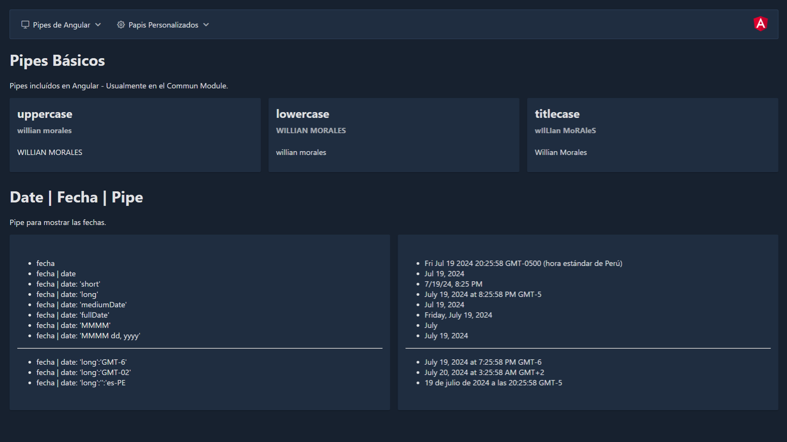

# PipeApp

This project was generated with [Angular CLI](https://github.com/angular/angular-cli) 12.2.0.



### The following Documentations were used:

> Angular pipes --> https://v12.angular.io/docs

> PrimeNg --> https://www.primefaces.org/

## Implemented Dependencies: 
* primeng
```
npm i primeng@12.2.2 --save
```
* primeIcons
```
npm install primeicons@4.1.0 --save
```
* primeFlex
```
npm install npm install primeflex@2.0.0 --sav
```
* angular Animation
```
npm install @angular/animations --save
```

## Note: 
### Install dependencies for running this project
```
npm install
```
